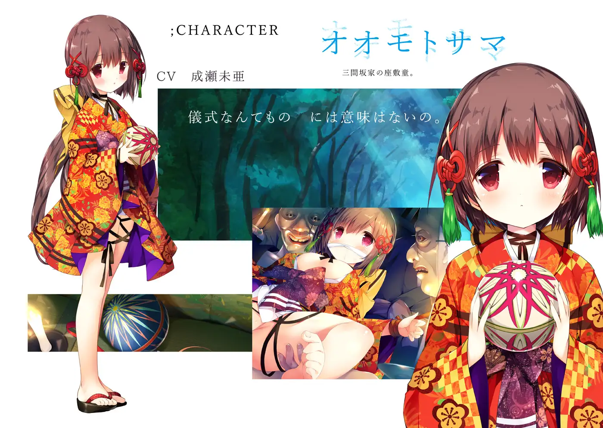
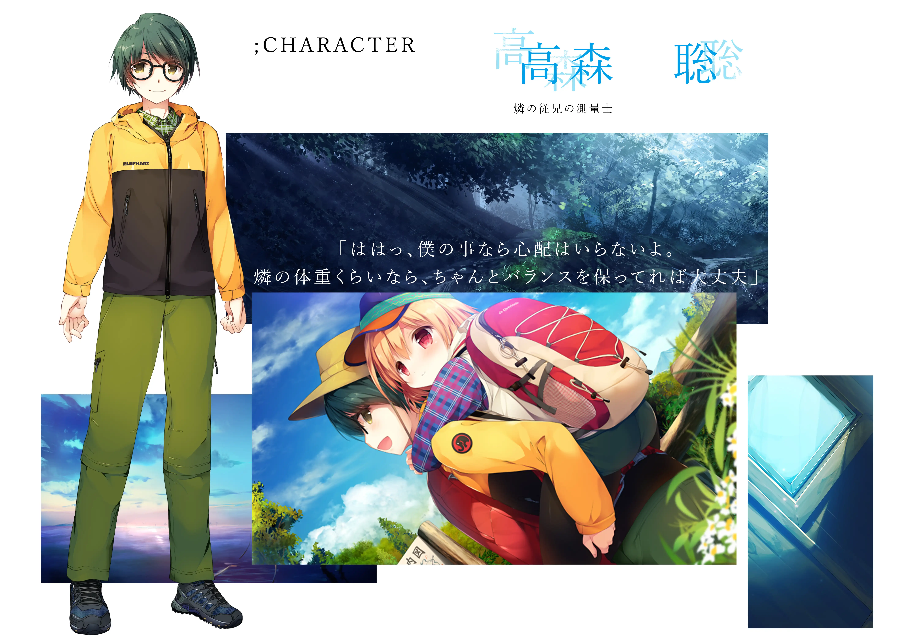
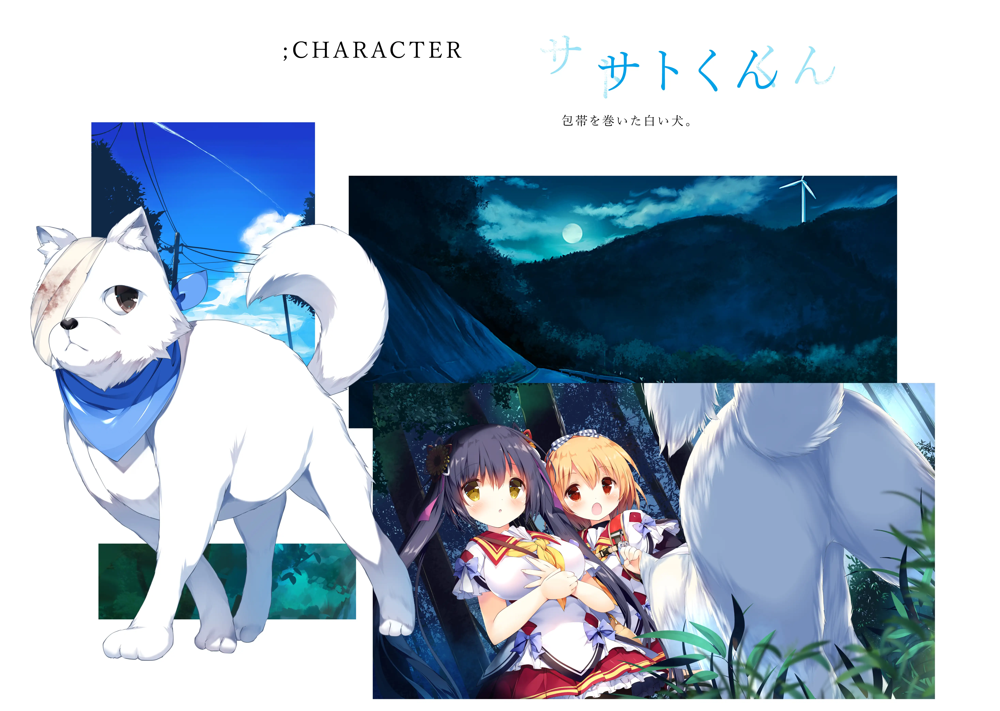
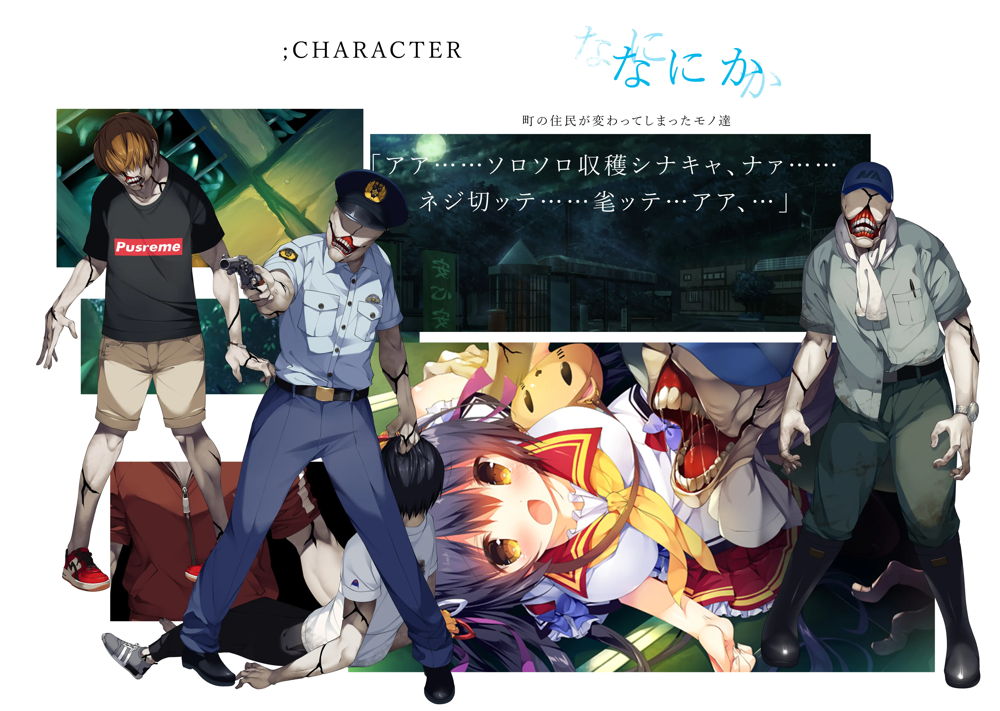
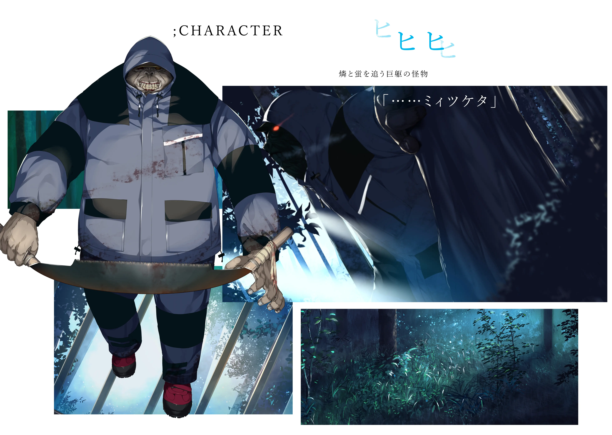

`作者: Serika，Sweep away Hunger！`

“别担心，我会守护萤的！” “有燐和我在一起，所以我不害怕。”

| 咨讯一览     |                  |
|:--------:|:---------------- |
| **开发商**  | KAI-SOFT |
| **游戏时长** | 6 - 8 H          |
| **类型**   | 哲学 恐怖 猎奇      |
| **难度**   | 极低                |
| **分级**   | R-18             |

## 故事梗概

燐和萤是在位于河流的中游位置的学校读书的好友。两人一起去镇上买东西，傍晚搭乘电车回家的时候不小心睡着了。燐醒来的时候，她们身处位于萤居住的村子的终点站。这里离自己要下的车站很远。燐一边笑一边自言自语“睡过头了，今天就住在萤的家吧”，但她很快察觉到情况不对劲。可能乘客都已经下车了，但明明还只是晚上八点，终点站内却空无一人……

两名少女似乎被卷入了一系列超自然现象中，其他人都变成了怪物！更糟糕的是，她们被怪物所追逐，她们的目标是在充满恶意和欲望的世界里活下去，能做到吗？

————我，和燐是朋友真是太好了————

她们一同穿过了小镇，想要离开这个诡异的地方——这片青空是什么地方？在少女们眼前的是澄澈的天空和一望无际的铁道，以及近在眼前的蓝色调的独栋小屋......

有什么在蠢蠢欲动，狒狒与狗上演着矛与盾、黑与白......世界正在崩坏！

## 登场人物

### 込谷燐（cv：榊原ゆい）

萤的好友，活泼的少女。 喜欢运动，擅长曲棍球。  父母离异，从小受堂哥照顾，有些喜欢他。

### 三间坂萤（cv：蒼依ハル）

三间坂家的独生女，继承了座敷童的血脉。 父母早逝，燐是她唯一的朋友。  有些自卑，羡慕燐的坚强和温柔

### 大本大人（cv：成瀬未亜）

三间坂家的座敷童。 存在于青空中的一座蓝色独栋房屋中，  代表着幸运，是世界之外的力量。

### 高森聪（cv：花宮楓）

燐的堂兄，测量技术员。 以前经常带着燐远足或者登山，  对堂妹的感情有点深沉？

### 聪君

缠着绷带的白狗。 多次拯救燐和萤，  和狒狒似乎是死对头？

### 那个人

村民变成的怪物。 散发着腐烂的臭气，  只想着肆无忌惮地发泄自己的欲望和恶意

### 狒狒

追赶燐和萤的高大怪物， 以杀戮村民变成的怪物为乐，  想要占有少女们，对燐格外执着。

## 简评

  
优点：

  </img>

 * 游戏的CG绘图清新优美：无垠而纯净的蓝天、幽静而蠢蠢欲动的山谷、永无止境的铁道。
 * 充斥着阴间的BGM和特效与可爱的画风反差极大，是精神享受！
 * 有些猎奇的be有各种奇奇怪怪的play，实用度可以。
 * 游戏以阿尔贝·加缪的哲学为主题思想，同时也融入宫泽贤治《银河铁道之夜》元素，内容充斥着哲学、超现实与民俗学的内容，值得考究，耐人寻味。

 

  
缺点：

  </img>

 * 剧情发展模式套路化，有种rpg游戏不断过关的感觉。
 * 意识流描写和晦涩的哲学内容不太容易理解，有吊书袋嫌疑。
 * 部分be内容容易令人引起不适，te结局有争议。 
 * 民俗相关设定老套，内容不佳。

 

| 评分        |      |
|:---------:|:----- |
| **人设**    | 6/10 |
| **立绘 & CG** | 9/10 |
| **剧情**    | 8/10 |
| **音乐**    | 7/10 |
| **综合**    | 8/10 |

## CG鉴赏


../image/青空的卡缪/cg01.webp
../image/青空的卡缪/cg02.webp
../image/青空的卡缪/cg03.webp
../image/青空的卡缪/cg04.webp
../image/青空的卡缪/cg05.webp
../image/青空的卡缪/cg06.webp
../image/青空的卡缪/cg07.webp
../image/青空的卡缪/cg08.webp
../image/青空的卡缪/cg09.webp
../image/青空的卡缪/cg10.webp
../image/青空的卡缪/cg11.webp
../image/青空的卡缪/cg12.webp
../image/青空的卡缪/cg13.webp
../image/青空的卡缪/cg14.webp
../image/青空的卡缪/cg15.webp
../image/青空的卡缪/cg16.webp
../image/青空的卡缪/cg17.webp
../image/青空的卡缪/cg18.webp
../image/青空的卡缪/cg19.webp
../image/青空的卡缪/cg20.webp
../image/青空的卡缪/cg21.webp
../image/青空的卡缪/cg22.webp


## 资源下载

游戏官网：

http://kai-soft.jp/BSC/index.html

## 哲学思想（头疼警告！！！）

加缪这个人一直否认自己是存在主义者，但事实上，存在主义又是什么呢？往大了走，却都是非理性主义的分支，那非理性主义又是什么呢，自叔本华与尼采以来？显然，他坚持否认的并不是存在主义，而是在与萨特的理性做对抗。萨特作为非理性主义者中最理性的人，他的论著中充斥着对手的逻辑，他常常批判那些前人中最理性主义的权威，他深刻理解他们的思想，以至于他也染上了那些理性，我更喜欢说，他是一个理性前提下的非理性主义者。

 加缪否认的，是萨特对于荒谬的态度，那是一种出于理性的理解，而失去荒谬的精髓，因为荒谬它本就是应该荒谬的，而萨特却用他惯用的存在证明去特意指出荒谬的存在。但加缪认为荒谬是本不该存在的存在。这里引用另外一个游戏的核心观念，那就是《隙间樱花与谎言都市》里所谓的“错误、谎言”，实际上指代的就是萨特的理念，那便是——荒谬是一种不合理，与合理（逻辑性，常理性，秩序性，可证性）相对，即证明其存在，也应该存在。

 但加缪并不这样认为，他觉得荒谬并不应该存在，这实际上已经彻底颠覆了存在主义的理念——因为万物本该存在。加缪认为，荒谬，是指代人与世界的冲突，人与世界都是美好的，荒谬是人与世界两个完美事物间派生的邪恶，但同样也是人高贵而美丽（不同于世界）的地方，那就是违背“完美调和”的世界前进，哪怕最后会淹没在世界的进程中。这被称为荒诞主义，以与存在主义作某种观念上的区分，但实际上，又并非如此。

 游戏终究是现代人的产物，不可能与过去完全重叠，却必然有它独有的思维。在游戏里，我们其实并没有看到加缪后来一直强调的这些荒谬主义与存在主义间根本上的激烈冲突，作者只是通过巨人、风车这些要素大概勾勒了几笔，而没有去过于突出这些，这是因为在某种角度上来讲，哪怕是加缪的荒谬，也同样是依存在人的存在上的。这大概就是最后，人们依然把加缪归到了他坚持否认的存在主义流派之下的原因。

 其他相关可以参考：

 https://tieba.baidu.com/p/6381216728?red_tag=0390506978

 https://tieba.baidu.com/p/6333306061

 https://tieba.baidu.com/p/6318230755?red_tag=0249564564

